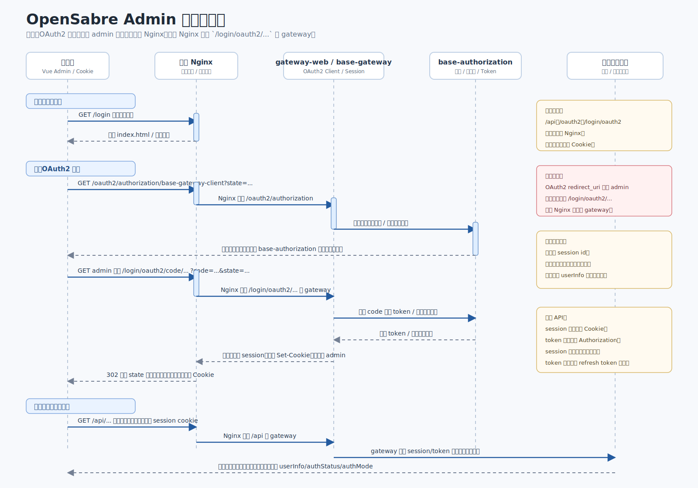

# OpenSabre Admin 登录链路说明

本文整理 `opensabre-admin` 管理站点从浏览器到前端 Nginx、gateway、认证中心和业务后端的登录与会话维护流程。



## 组件角色

- 浏览器：运行 Vue 管理端，保存同源 Cookie、localStorage/sessionStorage，并发起页面和 API 请求。
- 前端 Nginx：托管 `dist` 静态资源；把 `/api`、`/oauth2`、`/login/oauth2` 请求反向代理到后端入口。
- gateway-web/base-gateway：统一后端入口，处理 OAuth2 登录入口、回调、Session 与 Token 交换，并把业务请求转发到后端应用。
- base-authorization：OAuth2 授权服务，负责认证、授权码签发、Token 签发或校验。
- 后端业务应用：如组织、系统管理等服务，接收 gateway 转发后的业务请求。

## Nginx 路由规则

前端 Nginx 将静态资源直接从 `/usr/share/nginx/html` 返回：

- `/`：SPA 入口，未匹配文件时回退到 `index.html`。
- `*.js`、`*.css`、图片和字体：按静态资源缓存策略返回。

后端相关请求走统一反向代理：

```nginx
location ~ ^/(api|oauth2|login/oauth2)/ {
    proxy_pass http://opensabre_backend;
}
```

因此浏览器视角下，前端页面、OAuth2 入口、OAuth2 回调和 API 都是同源路径。浏览器会自动携带符合域和路径规则的 Cookie，前端代码不需要读取或保存 Session ID。

## OAuth2 登录流程

用户在登录页点击 OpenSabre 第三方登录入口后，前端执行：

```ts
window.location.href = "/oauth2/authorization/base-gateway-client?state=<redirectPath>";
```

完整链路：

1. 浏览器访问 `/oauth2/authorization/base-gateway-client?state=...`。
2. 前端 Nginx 将该请求代理到 gateway。
3. gateway-web 作为 OAuth2 Client，构造授权请求并重定向到 base-authorization。
4. base-authorization 完成用户登录和授权。
5. base-authorization 携带授权结果回调 admin 站点域名下的 `/login/oauth2/...`。
6. 前端 Nginx 匹配 `/login/oauth2`，将回调请求转发到 gateway。
7. gateway-web 使用授权结果换取 Token，并建立服务端 Session 或写入会话 Cookie。
8. gateway-web 通过 Nginx 将浏览器重定向回 admin 页面，通常是 `state` 中记录的目标路径。
9. admin 路由守卫调用当前用户接口恢复前端登录态。

关键点：OAuth2 模式下，浏览器回调地址属于 admin 站点，由 Nginx 转发给 gateway；前端代码不直接处理授权码、access token 或 session id，这些由 gateway-web 和 base-authorization 完成。

## 账号密码登录流程

当前项目也保留了直接账号密码登录：

1. 登录页先调用 `/api/sysadmin/captcha/send/image` 获取验证码。
2. 用户提交账号、密码和验证码。
3. 前端调用 `/api/v1/auth/login`。
4. 请求经 Nginx 转发到 gateway，再由 gateway/后端认证链路处理。
5. 接口返回 `accessToken` 和 `refreshToken` 时，前端按“记住我”写入 localStorage 或 sessionStorage。
6. 后续 API 请求由 axios 拦截器追加 `Authorization: Bearer <accessToken>`。

这条链路是 token 模式，和 OAuth2 session 模式并存。

## 前端登录态恢复

前端只把 `userInfo`、权限、租户上下文等可重建状态保存在 Pinia 中。刷新页面后 Pinia 会丢失，因此路由守卫需要重新确认认证状态。

当前实现逻辑：

1. 访问白名单 `/login` 时直接放行。
2. 访问受保护路由时，先检查 Pinia 中是否已认证。
3. 如果未认证，调用 `userStore.ensureAuthenticated()`。
4. `ensureAuthenticated()` 调用当前用户接口：
   - 有本地 access token 时，axios 追加 `Authorization`，按 token 模式恢复。
   - 无本地 token 时，不追加认证头，让浏览器自动携带 gateway session cookie，按 session 模式恢复。
5. 当前用户接口成功后，前端写入 `userInfo`、`authStatus=authenticated`、`authMode=token/session`。
6. 当前用户接口失败时，前端清理本地认证状态并跳转 `/login?redirect=<原路径>`。

## API 请求链路

业务 API 请求统一使用 `src/utils/request.ts` 中的 axios 实例：

1. 浏览器请求 `VITE_APP_BASE_API` 下的路径，例如 `/api/...`。
2. Nginx 匹配 `/api` 并代理到 gateway。
3. gateway 根据 session、token 或内部规则识别当前用户。
4. gateway 将请求转发到目标后端应用。
5. 后端返回统一响应码，前端只在 `code === "000000"` 时取 `data`。

认证失败处理：

- token 模式：如果本地存在 refresh token，前端调用刷新接口后重试原请求。
- session 模式：没有 refresh token，收到 `401` 或认证失效业务码时，直接清理状态并跳转登录页。

## 登出流程

用户点击退出时，前端调用 `/api/v1/auth/logout`。请求经 Nginx 和 gateway 到后端认证链路，后端应清除服务端 Session、Cookie 或 Token 状态。前端随后执行：

- 清除本地 token。
- 清空 `userInfo`、权限路由、字典缓存、页签视图。
- 断开 WebSocket。
- 跳转登录页。

## 当前待确认事项

- 当前用户接口仍临时使用 `/api/org/user/101`，建议后端提供基于当前 session/token 的接口，例如 `/api/org/me` 或 `/api/v1/users/me`。
- 角色和权限目前在前端临时硬编码，最终应由当前用户接口返回。
- OAuth2 登录成功后的最终回跳地址由 gateway 使用 `state` 处理，需保证只能跳回站内路径，避免开放重定向风险。
